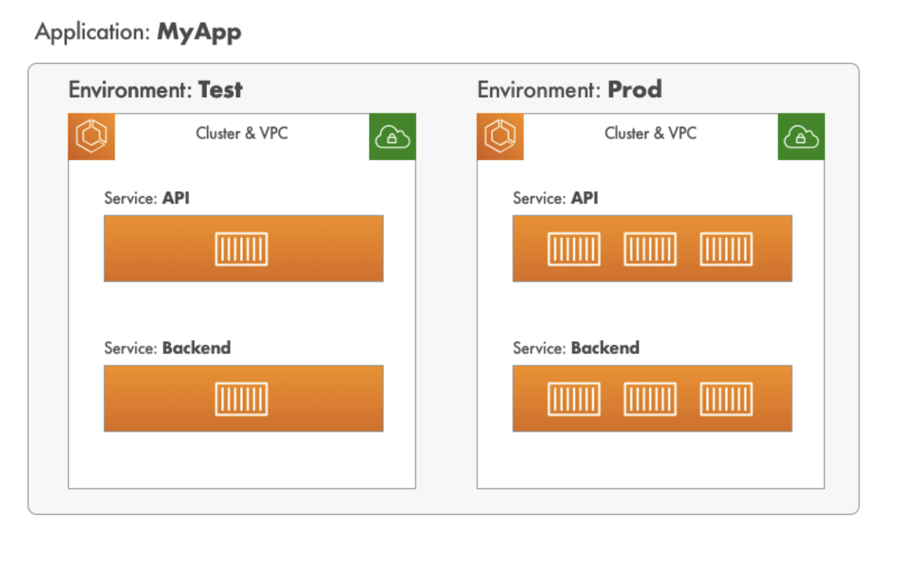

# deploy-ecs-container
Deploy frontend image container in AWS ECS, using best practices and DevOps approach

## Introduction
In this project you can deploy in minutes a complete architecture for a frontend application, using AWS ECS, AWS COPilot CLI and Docker.

This approach is created for provide to developers a fast way to change the infrastructure of the application, for example, if you want to change the number of instances, the number of tasks, the number of containers, the port, the image, etc. So if the project requires this dinamism, this approach is for you.

## Tools
- AWS CLI
- AWS COPilot CLI
- Docker

## AWS Services
- ECS
- ECR
- CloudWatch
- CloudFormation
- IAM
- VPC
- ALB
- Target Group
- Security Group
- S3
- DynamoDB

## Architecture



## Pre-requisites
- AWS account
- AWS CLI configured with your credentials
- AWS COPilot CLI installed
- Docker installed

## Steps

### Create Agrupation Concept for Aplication

1. Clone this repository
```
git clone https://github.com/danilmunoz1996/deploy-ecs-container.git
```

2. Go to the project directory
```
cd deploy-ecs-container
```

3. Create a new project using AWS COPilot CLI
```
copilot init
```

4. Enter the application name and the environment name: for example frontend

5. Select the type of workload
```
Load Balanced Web Service
```

6. Enter the name of the service
```
frontend-service
```

7. Set docker image
- Enter dockerFile path in case you have a Dockerfile builded inside the project
- Enter image URI in case you have a docker image in ECR

8. Select the port
- Review yor Dockerfile to know the port and enter it

9. Copilot answer if you want to deploy a test environment
- Enter yes if you want to deploy a test environment
- I prefer to set the test environment manually and then deploy it, so I enter no

10. Check the service created in the file copilot/frontend-service/manifest.yml
- I recommend to review the file copilot/frontend-service/manifest.yml and change the values of the variables that you want to change

11. (Optional) I recomend to setup secrets in section of secrets in the file copilot/frontend-service/manifest.yml

### Setup test environment

1. init test environment
```
copilot env init --name test
```

2. chose vpc and public subnets for test environment

3. check test environment created in the file copilot/test/environments/test/manifest.yml

4. I recomment to review the file copilot/test/environments/test/manifest.yml and change the values of the variables that you want to change

### Deploy test environment

1. Deploy test environment
```
copilot env update --name test
```

### Deploy service

1. Deploy service in test environment
```
copilot svc deploy --env test
```

### Deploy production environment

1. init production environment
```
copilot env init --name prod
```

2. chose vpc and public subnets for production environment, I recommend to select the option for create new vpc and new subnets, because the production environment must be isolated from the test environment

3. check production environment created in the file copilot/prod/environments/prod/manifest.yml

4. I recomment to review the file copilot/prod/environments/prod/manifest.yml and change the values of the variables that you want to change, probably you want to change the number of tasks and the number of instances

### Deploy production environment

1. Deploy production environment
```
copilot env deploy --name prod
```

### Deploy service

1. Deploy service in production environment
```
copilot svc deploy --env prod
```


